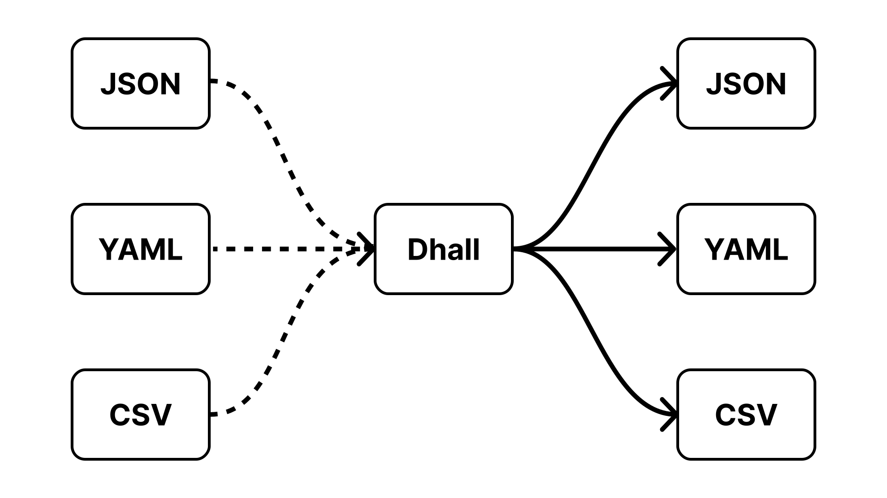

## Agenda

The goal of this tutorial is to learn about a programmable configuration language called Dhall.

To do this, we start by introducing configuration languages in general, with a hands-on example using JSON.
Afterwards, we introduce Dhall, with specific examples related to its type system.
We follow up by going deeper into the language by introducing functions.

Then, we rewrite the JSON example using Dhall, to showcase the benefits over JSON and non-typed configuration languages in general.

Finally, we introduce tools that let us convert from Dhall to other configuration languages such as JSON, YAML and CSV.
We also show tools that let us convert from other configuration languages to Dhall, and motivate why we'd want to do this.

## Intended Learning Outcomes

The intended learning outcomes of this tutorial is:
- To understand basic Dhall syntax.
- To create configuration files using Dhall.
- To generate configuration files in other languages using Dhall.
- To generate Dhall files from configuration files in other languages, and understand why this is useful.
